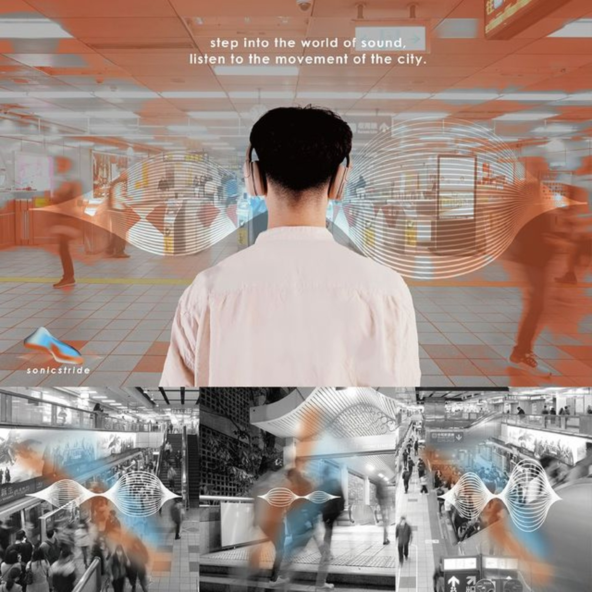

# Sonicstride

𝙨𝙩𝙚𝙥 𝙞𝙣𝙩𝙤 𝙩𝙝𝙚 𝙬𝙤𝙧𝙡𝙙 𝙤𝙛 𝙨𝙤𝙪𝙣𝙙,

𝙡𝙞𝙨𝙩𝙚𝙣 𝙩𝙤 𝙩𝙝𝙚 𝙢𝙤𝙫𝙚𝙢𝙚𝙣𝙩 𝙤𝙛 𝙩𝙝𝙚 𝙘𝙞𝙩𝙮.

#### ▌ Reconstructing the Body Awareness in Modern City-Taipei Metro Station as Experimental Field.

Sonicstride is a sound interactive system that connects the city and the body. It connects the real-time data of the environment (crowd density, movement speed) with the user's own data (movement speed) and interprets it through a sound interactive design, allowing the user to listen to the sound of his or her own walking speed and the environment in a specific urban space, thus strengthening the positive interaction between the environment and the body.

